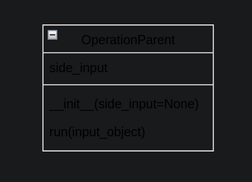
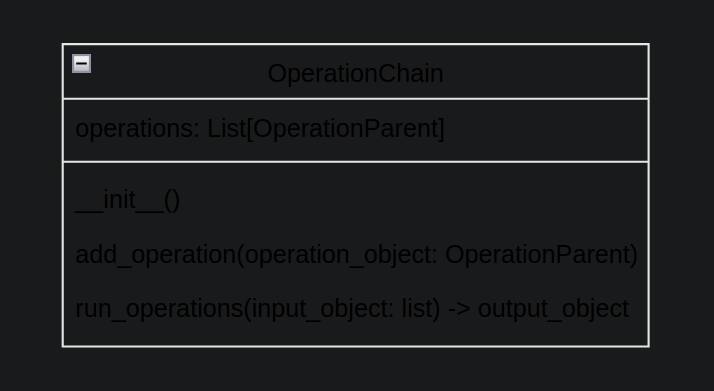
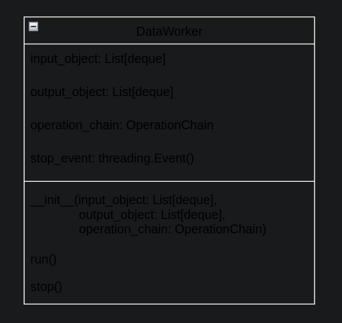
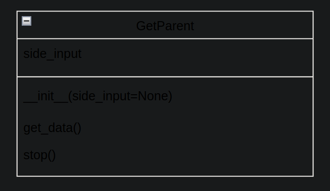
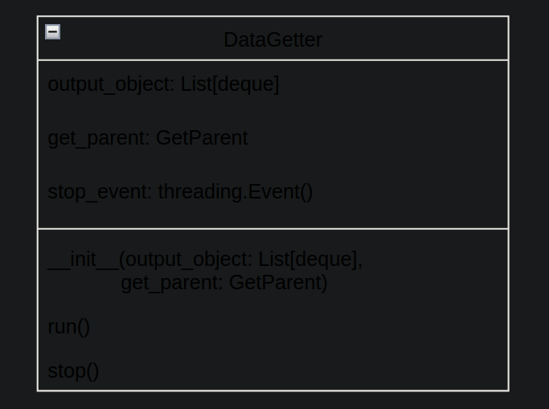
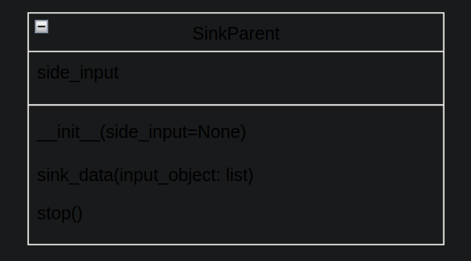
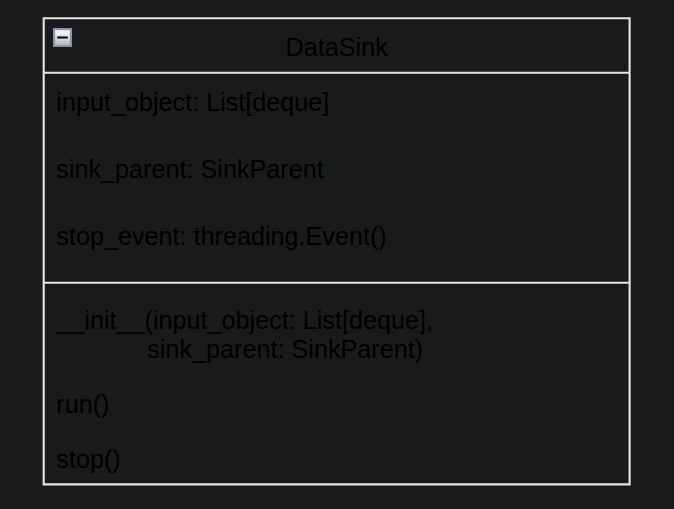
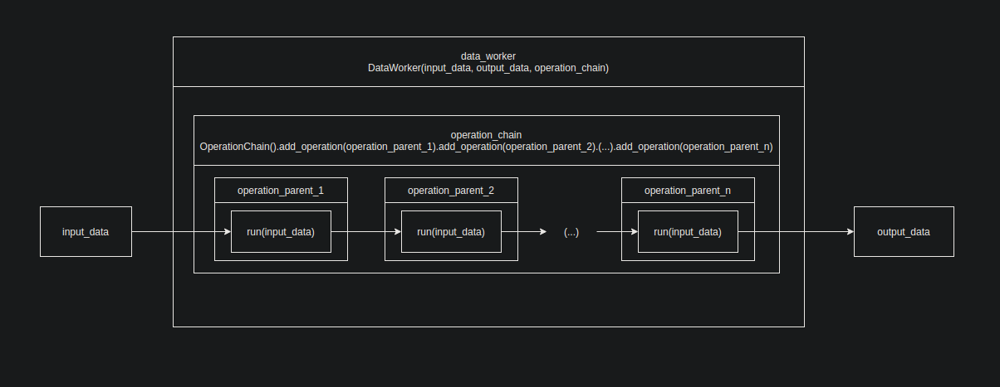

= Multi_Thread_Lib

== Introduction

Multi_thread_lib is a package that allows concurrent data operations, to be exact a creation of pipelines.

== Classes

The package contains following classes:

=== OperationParent

Operation interface is a class used as a basis for every pipeline in Multi_Thread_Lib. It should be inherited
by every data processing class. OperationParent contains run(input_object) method. It is in this method
that every data operation should be executed.

side_input field is used for additional data to be added during pipeline execution

=== OperationChain

OperationChain is a class used for data processing. It allows for a fast creation of a
 chain of operations to be executed on every single data object processed. The chain is defined following way:

operationChain = OperationChain().add_operation(operation1: OperationParent).add_operation(operation2: OperationParent).add_operation(operation3: OperationParent)

OperationChain also contains run_operations(input_object) method which is used by the DataWorker class to process data and shouldn't be used by the user.

Argument input_object of the run_operations method is a list of objects from each queue of the input_object of the DataWorker.

=== DataWorker

DataWorker is the class used for multithread data processing. The constructor accepts a reference to a list of input collections, a list of output collections
and an OperationChain used to process data. It runs the thread from it's constructor, the run() method should be ignored by the user.

The class contains stop() method used to stop data processing, it doesn't stop processing current data object, just prevents processing new objects.

=== GetParent

GetParent is a parent class for data input. The get_data() method is executed by DataGetter in every iteration. The
class has a stop() method called when DataGetter is stopped, it should be used to stop input connections.

It also has an optional side_input for additional data.

=== DataGetter

DataGetter is the class used for multithread data processing. The constructor accepts a reference to a list of output collections
and a GetParent used to gather data. It runs the thread from its constructor, the run() method should be ignored by the user.
DataGetter class calls the get_data() method of the GetParent every loop iteration.

The class contains stop() method used to stop data processing, it doesn't stop processing current data object, just prevents processing new objects.

=== SinkParent

SinkParent class is a parent class for the output of a pipeline. Method sink_data() is called in each iteration
of the DataSink object. Method stop() is called when DataSink is stopped.

It also has an optional side_input for additional data.

=== DataSink

DataSink is the class used for multithread data processing. The constructor accepts a reference to a list of input collections
and a SinkParent used to send output data. It runs the thread from its constructor, the run() method should be ignored by the user.
DataGetter class calls the sink_data() method of the GetParent every loop iteration.

The class contains stop() method used to stop data processing, it doesn't stop processing current data object, just prevents processing new objects.

== Pipeline

Data is processed like on the following diagram:

